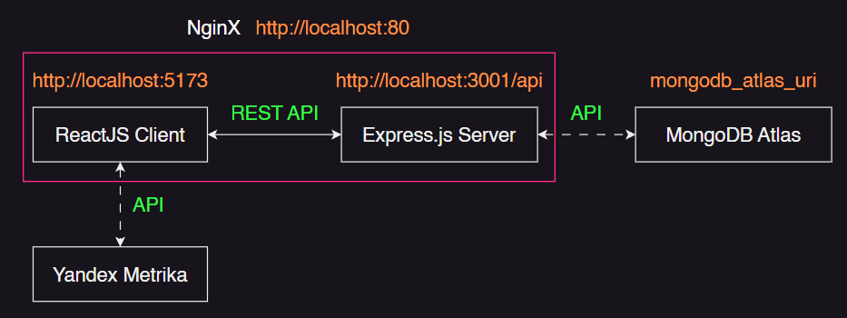

<!-- --------LOGO-------- -->
 

	
	
<strong>Спортивный Защитник</strong> - ваши права в фитнес-индустрии

<!-- --------ABOUT THE PROJECT-------- -->

## О проекте

	

 

<strong>Спортивный Защитник</strong> - использует следующие технологии:

<ul>
	<li>Express.js</li>
	<li>MongoDB</li>
	<li>Swagger</li>
	<li>Yandex Metrika</li>
	<li>Vite</li>
	<li>ReactJS + Router</li>
	<li>TypeScript</li>
	<li>MobX</li>
	<li>SWR</li>
	<li>Feature-Sliced Design</li>
	<li>React Hook Form + Zod</li>
	<li>EmailJS</li>
	<li>ESLint</li>
	<li>SCSS modules + BEM</li>
	<li>FontAwesome Icons</li>
</ul>

#### Немного о продукте

Согласно данным портала “Национальные проекты РФ», в 2023 г. число россиян, регулярно занимающихся спортом, возросло на 4 млн и составило 70 млн (это 53% от общей численности граждан).

Многие из них занимаются спортом непрофессионально, обращаясь к услугам фитнес-центров. Также граждане покупают спортивные товары и специализированное питание.

В связи с развитием данной сферы растет число случаев, когда покупатели сталкиваются с ненадлежащим оказанием спортивных услуг и некачественными товарами. Следовательно, им необходим инструмент для решения юридических проблем.

Результатом проекта является продукт, который предоставляет пользователям возможность получить справочно-правовую информацию (разъяснительные комментарии, пошаговые инструкции со ссылками на правовые акты и пр.), с помощью которой они смогут решить возникшие юридические проблемы в сфере фитнес-услуг

<!-- APP ARCHITECTURE  -->

## Архитектура приложения

	

<!-- SET UP INSTRUCTIONS -->

## Инструкция по запуску приложения

В папке `./client` выполните команды `npm i` и `npm run dev` для запуска клиента.

В папке `./server` выполните команды `npm i` и `npm run start` для запуска сервера.

Также подразумевается наличие _MongoDB_ с базой данных `defender` и коллекциями `faqs`, `documents` и `surveys`. Данные для БД лежат по следующему пути: `./mongodb-data/defender.*.json`.

<!-- --------CONTRIBUTING-------- -->

## Контрибуция

Контрибуция делает сообщество с открытым исходным кодом удивительным местом для обучения, вдохновения и творчества. Любой ваш вклад **высоко ценится.**

Если у вас есть предложение по улучшению, пожалуйста, сделайте fork репозитория и создайте pull request. Вы также можете просто создать issue с меткой "enhancement".
Не забудьте поставить star проекту! Спасибо еще раз!

1. Fork репозиторий
2. Создайте вашу Feature Branch (`git checkout -b feature/AmazingFeature`)
3. Сделайте коммиты с изменениями (`git commit -m 'Add some AmazingFeature'`)
4. Push в ветку (`git push origin feature/AmazingFeature`)
5. Откройте Pull Request
